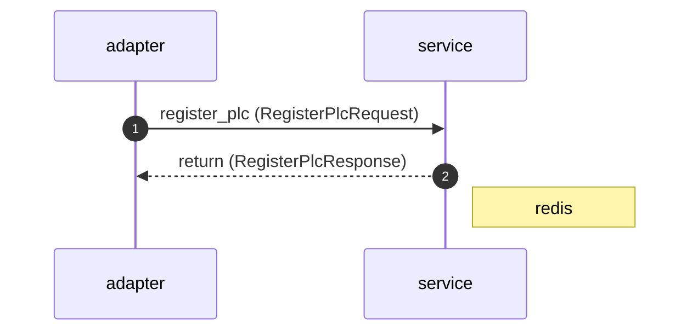
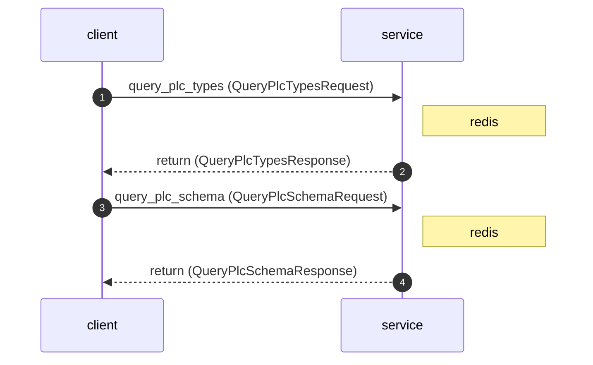
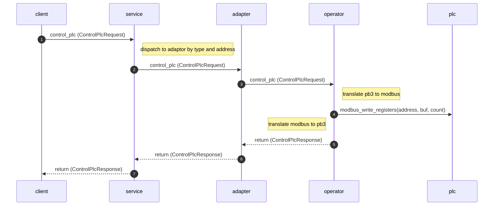
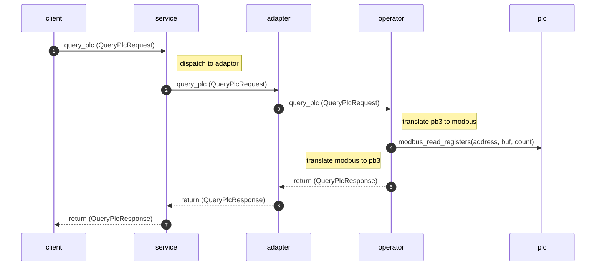

# 1. Sequence Diagrams

```mermaid
graph LR;
    client--rpc+exe-->service--rpc+exe-->adapter--lib-->operator--modbus+exe-->plc
```

## 1.1. register

```mermaid
sequenceDiagram
    autonumber
    participant adapter
    participant service

adapter->>service: register_plc (RegisterPlcRequest)
service-->>adapter: return (RegisterPlcResponse)

Note right of service: redis
```

## 1.2. query types and schema

```mermaid
sequenceDiagram
    autonumber
    participant client
    participant service

client->>service: query_plc_types (QueryPlcTypesRequest)
Note right of service: redis
service-->>client: return (QueryPlcTypesResponse)

client->>service: query_plc_schema (QueryPlcSchemaRequest)
Note right of service: redis
service-->>client: return (QueryPlcSchemaResponse)
```

## 1.3. query devices

```mermaid
sequenceDiagram
    autonumber
    participant client
    participant service

client->>service: query_plc_devices (QueryPlcDevicesRequest)
Note right of service: redis
service-->>client: return (QueryPlcDevicesResponse)
```

## 1.4. control plc

```mermaid
sequenceDiagram
    autonumber
    participant client
    participant service
    participant adapter
    participant operator
    participant plc

client->>service: control_plc (ControlPlcRequest)
Note right of service: dispatch to adaptor by type and address
service->>adapter: control_plc (ControlPlcRequest)
adapter->>operator: control_plc (ControlPlcRequest)
Note right of operator: translate pb3 to modbus
operator->>plc: modbus_write_registers(address, buf, count)
Note left of operator: translate modbus to pb3
operator-->>adapter: return (ControlPlcResponse)
adapter-->>service: return (ControlPlcResponse)
service-->>client: return (ControlPlcResponse)
```

## 1.4. query plc

```mermaid
sequenceDiagram
    autonumber
    participant client
    participant service
    participant adapter
    participant operator
    participant plc

client->>service: query_plc (QueryPlcRequest)
Note right of service: dispatch to adaptor
service->>adapter: query_plc (QueryPlcRequest)
adapter->>operator: query_plc (QueryPlcRequest)
Note right of operator: translate pb3 to modbus
operator->>plc: modbus_read_registers(address, buf, count)
Note left of operator: translate modbus to pb3
operator-->>adapter: return (QueryPlcResponse)
adapter-->>service: return (QueryPlcResponse)
service-->>client: return (QueryPlcResponse)
```

