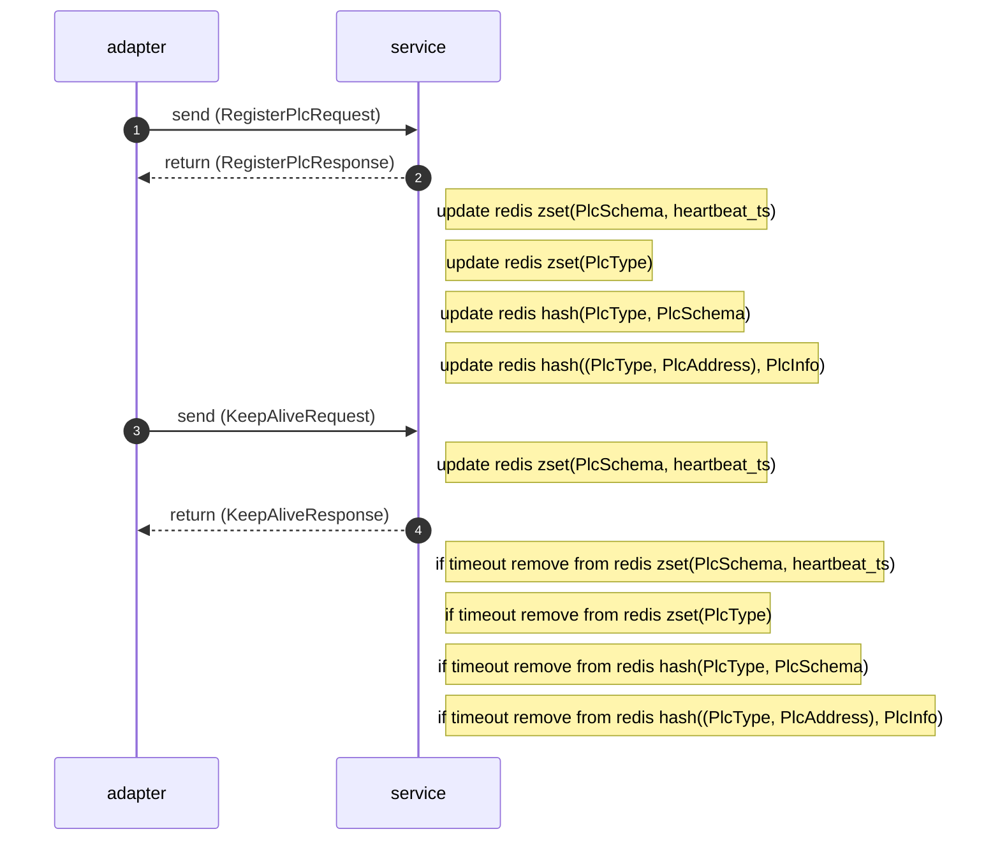
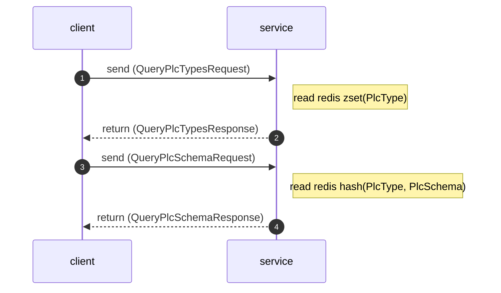
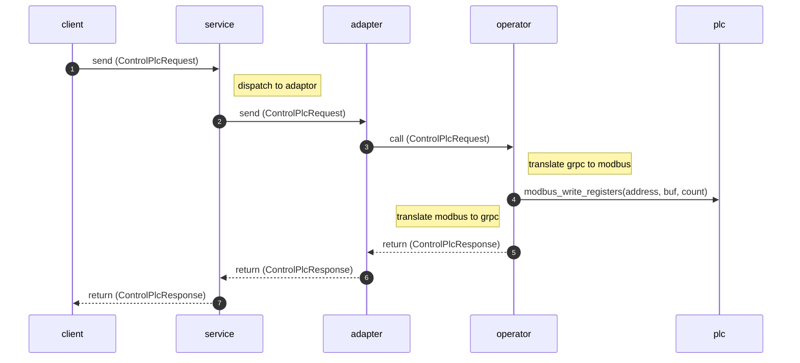
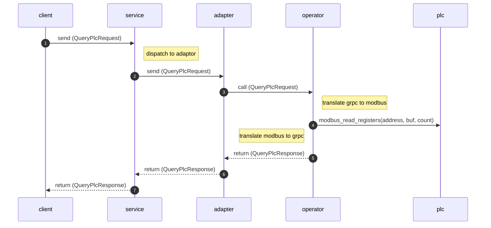

# 1. Sequence Diagrams
## 1.1. register and keep alive

```mermaid
sequenceDiagram
    autonumber
    participant adapter
    participant service

adapter->>service: send (RegisterPlcRequest)
service-->>adapter: return (RegisterPlcResponse)
Note right of service: update redis zset(PlcSchema, heartbeat_ts)
Note right of service: update redis zset(PlcType)
Note right of service: update redis hash(PlcType, PlcSchema)
Note right of service: update redis hash((PlcType, PlcAddress), PlcInfo)

adapter->>service: send (KeepAliveRequest)
Note right of service: update redis zset(PlcSchema, heartbeat_ts)
service-->>adapter: return (KeepAliveResponse)

Note right of service: if timeout remove from redis zset(PlcSchema, heartbeat_ts)
Note right of service: if timeout remove from redis zset(PlcType)
Note right of service: if timeout remove from redis hash(PlcType, PlcSchema)
Note right of service: if timeout remove from redis hash((PlcType, PlcAddress), PlcInfo)
```

## 1.2. query types and schema

```mermaid
sequenceDiagram
    autonumber
    participant client
    participant service

client->>service: send (QueryPlcTypesRequest)
Note right of service: read redis zset(PlcType)
service-->>client: return (QueryPlcTypesResponse)

client->>service: send (QueryPlcSchemaRequest)
Note right of service: read redis hash(PlcType, PlcSchema)
service-->>client: return (QueryPlcSchemaResponse)
```

## 1.3. control plc

```mermaid
sequenceDiagram
    autonumber
    participant client
    participant service
    participant adapter
    participant operator
    participant plc

client->>service: send (ControlPlcRequest)
Note right of service: dispatch to adaptor
service->>adapter: send (ControlPlcRequest)
adapter->>operator: call (ControlPlcRequest)
Note right of operator: translate grpc to modbus
operator->>plc: modbus_write_registers(address, buf, count)
Note left of operator: translate modbus to grpc
operator-->>adapter: return (ControlPlcResponse)
adapter-->>service: return (ControlPlcResponse)
service-->>client: return (ControlPlcResponse)
```

## 1.4. query plc

```mermaid
sequenceDiagram
    autonumber
    participant client
    participant service
    participant adapter
    participant operator
    participant plc

client->>service: send (QueryPlcRequest)
Note right of service: dispatch to adaptor
service->>adapter: send (QueryPlcRequest)
adapter->>operator: call (QueryPlcRequest)
Note right of operator: translate grpc to modbus
operator->>plc: modbus_read_registers(address, buf, count)
Note left of operator: translate modbus to grpc
operator-->>adapter: return (QueryPlcResponse)
adapter-->>service: return (QueryPlcResponse)
service-->>client: return (QueryPlcResponse)
```

