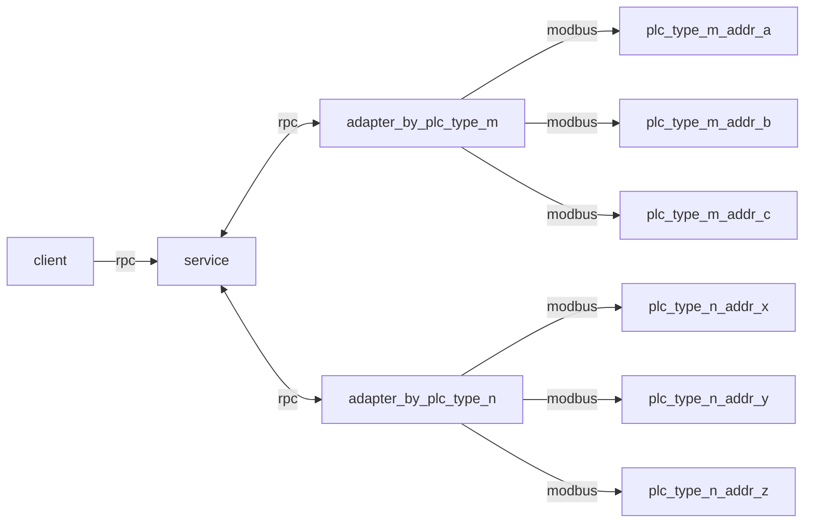
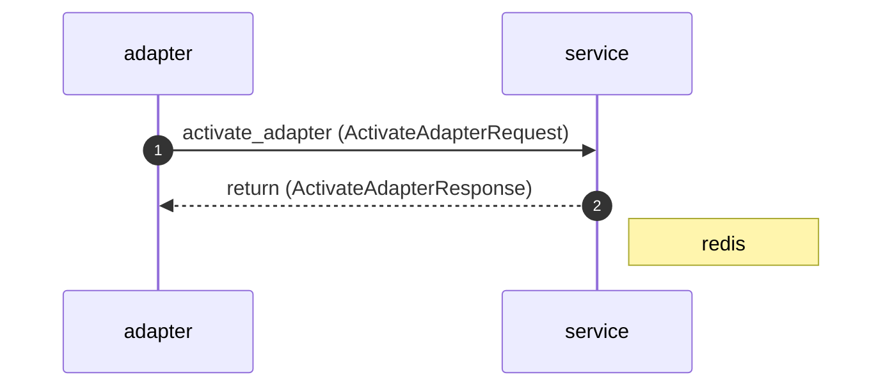
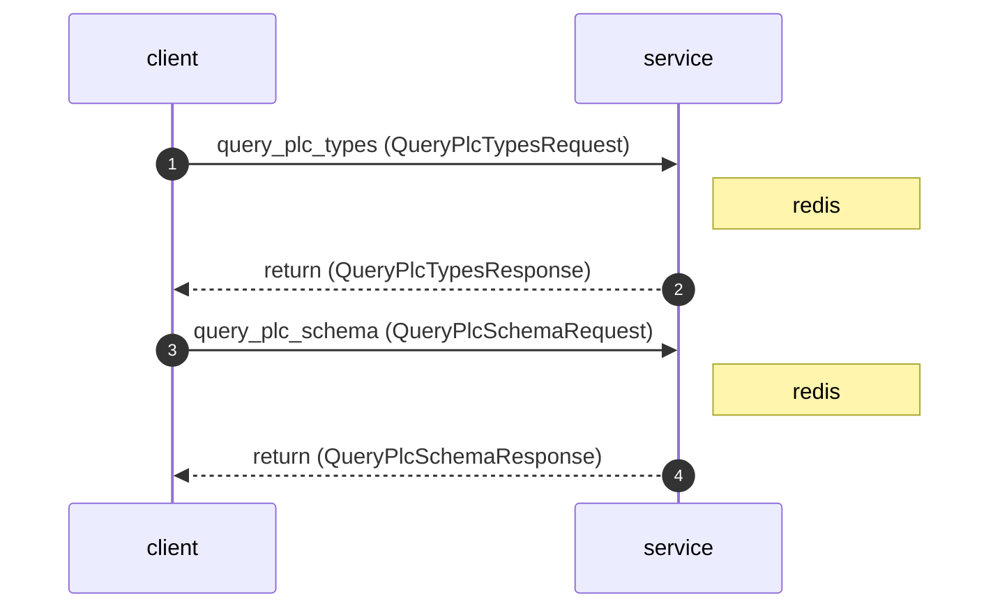
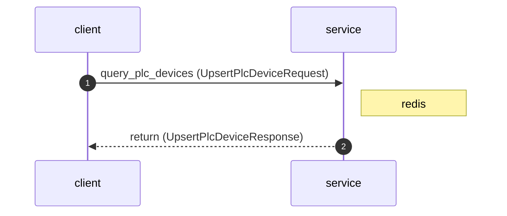
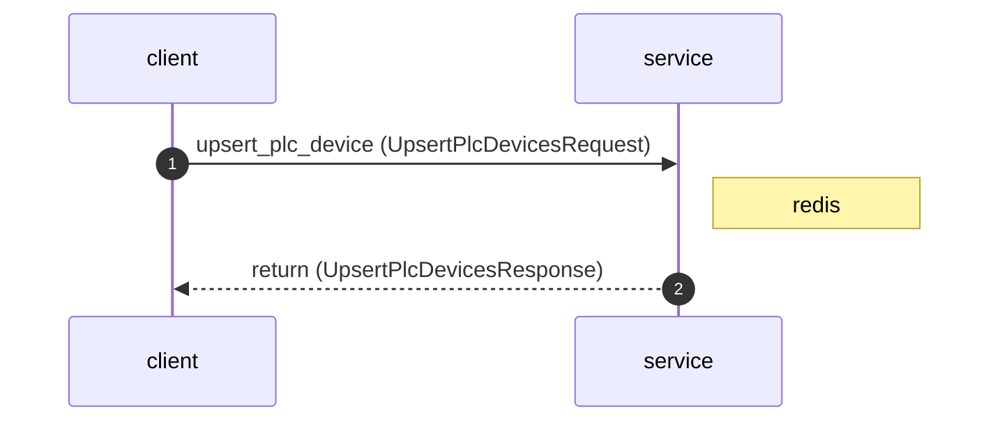
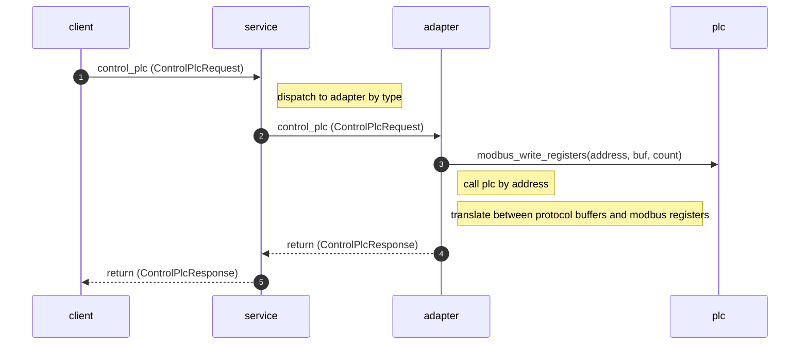
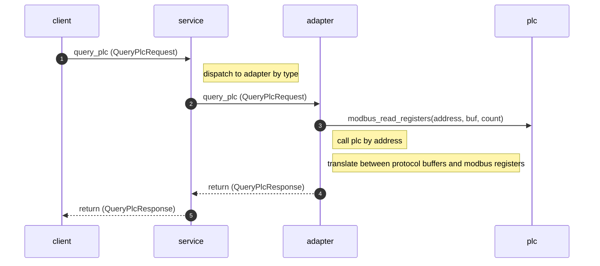

# 1. Sequence Diagrams

```mermaid
graph LR;
    client--rpc-->service<--rpc-->adapter_by_plc_type_m--modbus-->plc_type_m_addr_a
    adapter_by_plc_type_m--modbus-->plc_type_m_addr_b
    adapter_by_plc_type_m--modbus-->plc_type_m_addr_c
    service<--rpc-->adapter_by_plc_type_n--modbus-->plc_type_n_addr_x
    adapter_by_plc_type_n--modbus-->plc_type_n_addr_y
    adapter_by_plc_type_n--modbus-->plc_type_n_addr_z
```

## 1.1. activate adapter

```mermaid
sequenceDiagram
    autonumber
    participant adapter
    participant service

adapter->>service: activate_adapter (ActivateAdapterRequest)
service-->>adapter: return (ActivateAdapterResponse)

Note right of service: redis
```

## 1.2. query types and schema

```mermaid
sequenceDiagram
    autonumber
    participant client
    participant service

client->>service: query_plc_types (QueryPlcTypesRequest)
Note right of service: redis
service-->>client: return (QueryPlcTypesResponse)

client->>service: query_plc_schema (QueryPlcSchemaRequest)
Note right of service: redis
service-->>client: return (QueryPlcSchemaResponse)
```

## 1.3. query devices

```mermaid
sequenceDiagram
    autonumber
    participant client
    participant service

client->>service: query_plc_devices (UpsertPlcDeviceRequest)
Note right of service: redis
service-->>client: return (UpsertPlcDeviceResponse)
```

## 1.4. upsert device

```mermaid
sequenceDiagram
    autonumber
    participant client
    participant service

client->>service: upsert_plc_device (UpsertPlcDevicesRequest)
Note right of service: redis
service-->>client: return (UpsertPlcDevicesResponse)
```

## 1.5. control plc

```mermaid
sequenceDiagram
    autonumber
    participant client
    participant service
    participant adapter
    participant plc

client->>service: control_plc (ControlPlcRequest)
Note right of service: dispatch to adapter by type
service->>adapter: control_plc (ControlPlcRequest)
adapter->>plc: modbus_write_registers(address, buf, count)
Note right of adapter: call plc by address
Note right of adapter: translate between protocol buffers and modbus registers
adapter-->>service: return (ControlPlcResponse)
service-->>client: return (ControlPlcResponse)
```

## 1.6. query plc

```mermaid
sequenceDiagram
    autonumber
    participant client
    participant service
    participant adapter
    participant plc

client->>service: query_plc (QueryPlcRequest)
Note right of service: dispatch to adapter by type
service->>adapter: query_plc (QueryPlcRequest)
adapter->>plc: modbus_read_registers(address, buf, count)
Note right of adapter: call plc by address
Note right of adapter: translate between protocol buffers and modbus registers
adapter-->>service: return (QueryPlcResponse)
service-->>client: return (QueryPlcResponse)
```

